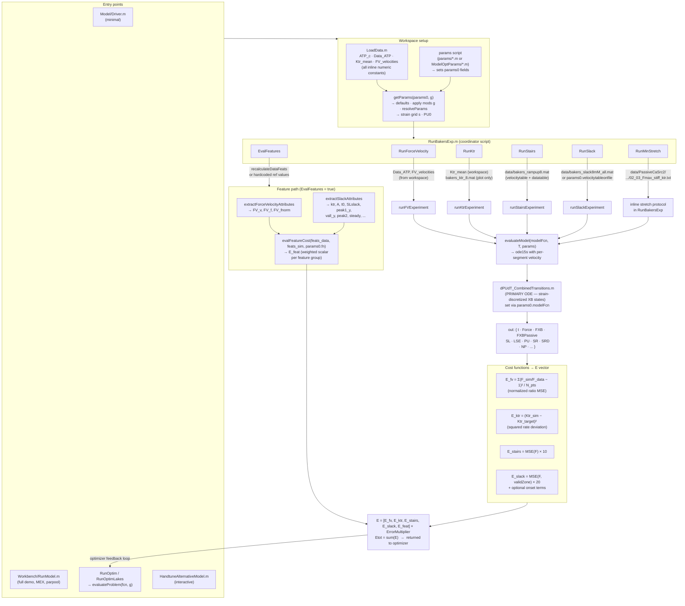

# ATP Depletion and Heart Failure — Cross-Bridge Model

MATLAB codebase implementing a strain-discretized cardiac cross-bridge (sarcomere) model to study the effects of ATP depletion in heart failure. Based on [Beard et al. 2022](https://www.sciencedirect.com/science/article/pii/S0006349522006026).

---

## 👉 New here? Start with [`Example/`](Example/README.md)

```matlab
cd('<repo root>'); addpath(genpath('.'));
Example\RunExampleHighATP
```

A working, heavily-commented entry point: it loads the current best high-ATP (8 mM)
parametrization, runs all four mechanical protocols (slack, ktr, staircase,
force-velocity) against real recordings, and plots the per-feature fit. Takes ~2.5
minutes. [`Example/README.md`](Example/README.md) documents the protocols, the
parameter system, the feature/cost machinery, and the known residuals.

`Example/BuildExampleProtocol.m` + `RunExampleProtocol.m` show how to drive the
model with a length protocol of your own design.

---

## Naming Conventions

| Pattern | Meaning |
|---------|---------|
| `FirstCapital.m` | Script — runs and leaves variables in the workspace |
| `firstLowercase.m` | Function — has explicit return values |

---

## Directory Structure

```
ATP-depletion-and-heart-failure/
│
├── Example/            START HERE — commented starter driver for the high-ATP
│                       protocol battery + how to build your own protocol
│
├── Model/              Core ODE engine, parameter system, experiment runners,
│   │                   feature extraction and cost functions — model code ONLY
│   └── experiments/    Specialized protocol runners (FV, ktr, slack, stairs)
│
├── DataCuration/       Raw data → model-ready data: log loading, resampling,
│                       velocity-table construction, protocol building
│
├── Analyses/           One self-contained folder per analysis: script(s) +
│   │                   results/ + conclusions.md. START AT Analyses/README.md
│   ├── README.md       Index + cross-analysis summaries & recommendations
│   ├── AttachedPool_vs_ATPase/   BindingSiteOccupancy/   RestretchMechanisms/
│   ├── SensitivityAnalysis/      LastSlackIdentification/  PassiveForceID/
│   └── LowATP_ForceEnhancement/
│
├── Workbench/          The playground: drivers, hand-tuning, optimization entry
│   └── Tests/          points, ad-hoc experiments and tests (not finished analyses)
│
├── Auxiliary/          Generic reusable, non-critical tools (plotting, fitting,
│   └── diagnostics/    parsing); SRX/ktr/mech diagnostic probes live here
│
├── ModelOptParams/     Historical named param gallery + QC plots (past optima)
├── params/             Active/current parameter snapshots (source of truth)
│
├── PassiveTitin/       Passive titin characterization scripts and Modelica model
├── Modelica/           Modelica source models
│
├── Docs/               Knowledge base — START AT Docs/README.md
│   ├── reference/      Durable reference docs you build on
│   ├── notes/          Working notes / lab diaries (chronological)
│   ├── experiments/    Dated experiment write-ups (+ figures/)
│   ├── presentations/  Slides, posters, abstracts (old versions in archive/)
│   ├── ROADMAP.md      Consolidated next-steps backlog
│   └── *-plan.md       Process docs (reorganization / refactoring)
│
├── Figures/            Generated and reference figures
├── scripts/            Infrastructure (setup-gh.sh, rol.sbatch)
│   └── fulldata/       Private full-data repo: seeding, sync workflow, payload
│                       manifest. See scripts/fulldata/README.md
├── data/               Experimental data — not tracked by git
└── _archive/           Disk-only graveyard for stale dumps (gitignored)
```

> **Two front doors:** [`Docs/README.md`](Docs/README.md) maps all knowledge;
> [`Analyses/README.md`](Analyses/README.md) indexes the analyses with rolled-up
> recommendations. **`params/` vs `ModelOptParams/`:** `params/` holds the active,
> current parameter snapshots (the working source of truth); `ModelOptParams/` is the
> historical gallery of past named optima with their QC plots. Bulk generated output
> (`.mat`/`.png` dumps, old optimizer envs) lives in the gitignored `_archive/`.

---

## Key Workflows

### 1. Demo — run the model once

```matlab
% Minimal — Model/Driver.m (canonical entry point)
cd Model
Driver

% Full demo with MEX and parallel pool:
cd Workbench
RunModel
```

### 2. Evaluate fit against Baker lab data

```matlab
% In any script after addpath(genpath('.'))
LoadData;                          % loads data into workspace
params0 = getParams();             % build parameters (all defaults)
ModelParamsInitNiceSlack_prescribedSR  % apply a saved param set
RunBakersExp                       % runs all active protocols, sets E (cost vector)
```

### 3. Interactive parameter tuning

```matlab
Workbench/HandtuneAlternativeModel   % loads data, lets you tweak params0 interactively
```

### 4. Run an optimisation

```matlab
% Set params0 and g0 first, then:
Workbench/RunOptimLakes    % Lakes optimizer (recommended)
Workbench/RunOptim         % fminsearch optimizer
```

### 5. Multi-dataset protocol comparison (slack, ktr, step, staircase)

```matlab
Workbench/CompareProtocols   % loads all datasets, fits all feature types, plots comparisons
```

---

## Full Pipeline Diagram



---

## Core Execution Stack

```
RunBakersExp (coordinator script)
  └─ evaluateProblem()            wrapper: set params0, call RunBakersExp, return error
       └─ evaluateModel()         integrate ODE for one condition (ode15s)
            └─ dPUdT_CombinedTransitions()   PRIMARY ODE right-hand side
                 └─ getParams()   central parameter management (call after any SL0 change)
```

### ODE State Vector

```
PU = [p1(1..ss), p2(1..ss), [p3(1..ss),]  P_SR, NP, SL, LSE, PD, [P_SRD,] [x_dash]]
```

where `ss = numel(params.s)` = number of strain bins.

---

## Adding a New Protocol Experiment

1. **Create** `Model/experiments/runMyExperiment.m` — return `[E_new, out, features_model, features_data]`:
   ```matlab
   function [E, out, fm, fd] = runMyExperiment(params0)
       modelFcn = str2func(params0.modelFcn);
       params = params0;
       datastruct = load('../data/my_data.mat');  % load your data file
       params.Velocity = datastruct.velocitytable(:, 2);
       params = getParams(params, params.g, true);
       [~, out] = evaluateModel(modelFcn, datastruct.velocitytable(:, 1), params);
       Fi = interp1(out.t, out.Force, datastruct.datatable(:, 1));
       E  = mean((datastruct.datatable(:, 3) - Fi).^2) * 10;  % MSE × scale
       fm = struct(); fd = struct();  % optionally populate via extractSlackAttributes etc.
   end
   ```

2. **Register the flag** in `getParams.m` defaults:
   ```matlab
   params.RunMyProtocol = false;  % add near other Run* defaults
   ```

3. **Wire into coordinator** `RunBakersExp.m`:
   ```matlab
   if params0.RunMyProtocol
       [E_new, out_new] = runMyExperiment(params0);
       E(end+1) = E_new;
   end
   ```

4. **Enable it** in your param script: `params0.RunMyProtocol = true;`

---

## Model/ — Core Files

| File | Role |
|------|------|
| `Driver.m` | **Canonical entry point** — minimal script; run from `Model/` |
| `getParams.m` | **CENTRAL** — builds/updates the params struct; call after changing any field |
| `dPUdT_CombinedTransitions.m` | **PRIMARY ODE** — set via `params0.modelFcn`; all active mechanisms |
| `evaluateModel.m` | Integrates ODE for one experimental condition |
| `RunBakersExp.m` | Coordinator: runs FV, ktr, slack, staircase protocols and computes E |
| `evaluateProblem.m` | Thin wrapper for use by optimisers |
| `resolveParams.m` | Resolves `'='`-prefixed param fields as MATLAB expressions |
| `LoadBakersExp.m` | Loads and plots all Baker lab experimental data files |
| `extractSlackAttributes.m` | Feature extraction from slack-release protocol output |
| `extractForceVelocityAttributes.m` | Feature extraction from FV protocol output |
| `extractPerturbAttributes.m` | Feature extraction from perturbation (ktr) protocol output |
| `evalFeatureCost.m` | Feature-based cost function (data vs simulation) |
| `updateRates.m` | Scale all turnover rates by `xrate` multiplier |
| `handleAndRethrowCostException.m` | Error handling wrapper for cost evaluation |
| `simulateForceLengthEstim.m` | Force-length estimation simulation |
| `dPUdTCa.m` | Legacy / alternative ODE variant (still referenced; kept) |
| _(archived)_ | Dead ODE variants `dPUdTCaSimple`, `dPUdTCaSimpleAlternative`, `dPUdT_TransitionRates` moved to `_archive/dead_ode/` (no callers) |
| `experiments/` | `runFVExperiment`, `runKtrExperiment`, `runSlackExperiment`, `runStairsExperiment` |

---

## Auxiliary/ — Utilities

Generic reusable tools with no specific analysis context — called from many places.

| File | Role |
|------|------|
| `animateStateProbabilities.m` | Animate cross-bridge state probability distributions |
| `plotStateFluxes.m` / `plotFeatures.m` / `plotRates.m` | Visualization |
| `StatesInTime.m` / `runStatesInTime.m` | State probability time series |
| `VisualizeSensMat.m` | Visualize sensitivity matrix output |
| `calcSensitivities.m` | One-at-a-time parameter sensitivity analysis |
| `ResidualAndJacobian.m` | Residual vector and Jacobian for SA / optimization |
| `fitRecovery.m` / `fitSlackForceOnset.m` | Fitting utilities |
| `writeParamsToMFile.m` | Serialize params struct to a `.m` file |
| `sigLookup.m` | Catmull-Rom interpolation lookup in sig struct |
| `matchStructFields.m` / `insertAt.m` / `getAllDifferent.m` | Generic struct/array utilities |

---

## DataCuration/ — Data Pipeline

Scripts that turn raw experimental recordings into the `.mat` files the model consumes.
All scripts use `../data/` paths and are run from the `DataCuration/` directory.

### Baker lab legacy data (8 / 2 / 0.2 mM ATP protocols)

The pre-processed `data/*.txt` and `data/bakers_slack8mM_all.mat` files are already
ready for the model — no DataCuration step needed for standard fitting.

Optional modifications:
- `BuildUpdatedSlackProtocol.m` — rebuild velocity table with uniform hold/recovery durations → `data/bakers_slack8mM_update.mat`
- `ManipulateVelocityTable.m` — further adjustments → `data/bakers_slack8mM_all_fix.mat`
- `LoadBakersIsovelocity.m` — load and inspect Baker isovelocity dataset

### New 2026 driving-signal experiments (`data/03 27 2026 M/`, `data/04 03 2026 F/`)

Run in this order:

```
1. LoadAndPlotLogs          — inspect raw Log_*.txt files; writes AllDataMerged.mat to data dir
2. preprocessDrivingSignal  — resample + smooth merged .txt  →  *_proc.mat  (sig struct)
3. CreateProtocolVelocityTable  — extract velocity table from merged .txt
                                  →  data/protocol_03_27_2026_velocitytable_slack.mat
4. ClipDrivingSignal        — clip proc.mat signal to the protocol window
                              →  data/protocol_03_27_2026_PassiveCa_slack.mat
5. ExtractFeatures0327      — extract model-comparable scalar features from the processed data
                              (optional; for comparison, not required to run the model)
```

Point the model at the outputs via:
```matlab
params0.velocitytableonfile = '../data/protocol_03_27_2026_velocitytable_slack.mat';
```

### Passive stiffness (`data/PassiveCaSrc2/`)

- `GetKstiffFromViscoElasticityMeasurements.m` — reads dated subdirectories, extracts stiffness and Fmax values used for titin model parameter identification
- `FitRundownCorrection.m` — fits a parametric rundown correction surface `F_ref ≈ f(F_rd, SL)`; requires `AllDataMerged.mat` from step 1 above

---

## Workbench/ — Interactive Exploration

| File | Role |
|------|------|
| `RunModel.m` | Full demo with MEX and parallel pool |
| `HandtuneAlternativeModel.m` | Interactive parameter tuning loop |
| `HandtuneSlackParams.m` | Slack-specific parameter tuning |
| `RunOptim.m` / `RunOptimLakes.m` | Optimisation entry points |
| `Force_pCa.m` | Force-pCa curve at varying ATP concentrations |
| `CompareProtocols.m` | Multi-dataset comparison: slack, ktr, step, staircase across ATP levels |
| `RunAllParametrizatinos.m` | Batch evaluation across all saved parameter sets |
| `Tests/` | Validation scripts for individual subsystems (`TestSR`, `TestFitRates`, etc.) |

---

## Analyses/ — Self-Contained Analyses

Each analysis lives in its own folder under `Analyses/<Topic>/`: the script(s), a `results/`
folder for its `.mat`/figure outputs, and a `conclusions.md` recording findings and next steps.
**Start at [`Analyses/README.md`](Analyses/README.md)** for the index and the cross-analysis
summaries & recommendations.

| Folder | What it covers |
|------|------|
| `AttachedPool_vs_ATPase/` | Attached-pool / ATPase / k_tr / V_max reconciliation at baseline |
| `BindingSiteOccupancy/` | Attachment-saturation audit (strain axis ≠ binding-site axis) |
| `RestretchMechanisms/` | Last-slack restretch double-peak mechanism analysis (incl. `AnalyseRestretchMechanisms`, `TuneRestretch`, `RunMechanismEvaluation`, `OptimizeMechanismEvaluation`) |
| `SensitivityAnalysis/` | 108-parameter sensitivity + SVD identifiability (`SensitivityAllSlack`, `RunSensitivityAnalysis`, `FeatureCorrelation`) |
| `LastSlackIdentification/` | Piecewise strain-dependent detachment fit (`OptimLastSlackPieceWise`, `IdentifyLastSlack`) |
| `PassiveForceID/` | Justifying direct subtraction of the high-Ca passive trace (`IdentifyPassive`) |
| `LowATP_ForceEnhancement/` | Why low ATP raises isometric force (03/27/2026 data) |

> Reorg note (2026-06-16): the former `Analysis/` (singular) folder was absorbed here. Loose
> non-analysis scripts moved to `Workbench/` (e.g. `BatchRunAllParams`, `SumATPSlackFitPlots`),
> `Workbench/Tests/`, or `Auxiliary/` (`ResidualOpt`); obsolete pipelines (`RunOptimPiecewise`,
> `driverSA`, `runSA`, `analyzeSystemRHS`) were moved to `_archive/`.

---

## params/ — Parameter Sets

Active, current parameter snapshots — the working source of truth. Load a `.m` file to
populate `params0` before running:

```matlab
params0 = getParams();
ModelParamsInitNiceSlack_prescribedSR    % apply saved param set
```

Also holds non-`.m` snapshots consolidated during the reorg (`params.csv`, `modifierstbl.csv`,
`gaOutparams.csv`, `PARAMETERS.xlsx`, `all params.txt`, `SimplestFVOptim*.m`). See
`ModelOptParams/` for the historical gallery of named past optima and their QC plots.

---

## Key Behavioural Switches in params0

| Switch | Description |
|--------|-------------|
| `UseSuperRelaxed` | Enable super-relaxed (SRX) myosin head state |
| `UseSuperRelaxedADP` | SRX with ADP-bound variant |
| `UseOverlap` / `UseOverlapFactor` | Filament overlap corrections |
| `UsePassive` / `UseTitinIdentifiedPassive` | Passive titin-based force |
| `UseSerialStiffness` | Serial elastic element |
| `UseSlack` | Enable slack-restretch protocol in simulation |
| `UseDirectSRXTransition` | Direct SRX↔IHM transition variant |
| `NumberOfStates` | 2 or 3 cross-bridge states |
| `EvalFeatures` | Use feature-based (vs time-domain) cost function |

---

## Running from WSL

Use the MCP MATLAB server (preferred — keeps session alive, no startup penalty).  
Or via CLI:

```bash
"/mnt/c/Program Files/MATLAB/R2023a/bin/matlab.exe" \
  -batch "cd('C:\home\git\ATP-depletion-and-heart-failure'); addpath(genpath('.')); RunModel"
```
